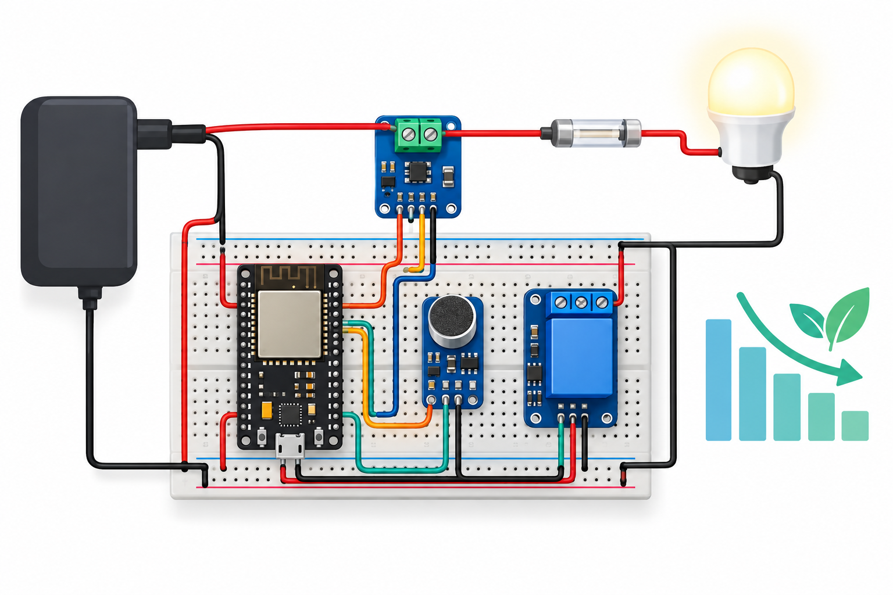

# Smart Entryway Energy Saver

An ESP32 educational controller uses an INA219 current sensor and analog microphone to switch a low voltage demonstration lamp off after quiet, low-current inactivity. MQTT provides optional telemetry and commands.



## Overview, objectives and features
Learn high-side current measurement, sound activity, bounded idle timing and fail-off latching. Two loud samples wake the lamp; 30 seconds with current<80mA and no loud sound switches it off. Invalid data or current≥500mA latches off. This is a rule-based demo; hardware energy savings are not measured.

## Architecture and platform
ESP32 DevKit esp32dev, Arduino, INA219 I2C and PubSubClient. Shared host-tested policy drives a real relay. Networking is optional; local sensing works without MQTT. [Architecture](docs/architecture.md).

## BOM quantities
| Quantity | Item |
|---|---|
| 1 | ESP32 DevKit |
| 1 | INA219 0x40 high-side breakout |
| 1 | 3.3V analog microphone module |
| 1 | Active-high 3.3V-compatible relay module,5V coil |
| 1 each | Nominal40mA5V LED lamp,regulated5V supply,0.5A fuse |
| 1 each | 10kΩ resistor,breadboard,USB cable |
| 12 | Jumper wires |
| 1 optional | Isolated MQTT broker |

## Prerequisites
Python3.12, PlatformIO6.1.18, C++17 compiler, USB serial driver and correctly rated low voltage parts. INA219 polarity/calibration and microphone bias must be verified before real use.

## Exact pin map and circuit/wiring
| ESP32 | Connection |
|---|---|
| GPIO21/22 | INA219 SDA/SCL |
| GPIO34 | Mic analog OUT≤3.3V |
| GPIO25 | Relay IN;10kΩ pull-down |
| 3V3 | INA219 VCC,mic VCC |
| GND | Both sensor grounds,relay GND,external negative,lamp negative |
| USB | Controller5V input |
| External5V | Relay VCC;0.5A fuse→INA219 VIN+ |
| INA219 VIN− | Relay COM |
| Relay NO | Lamp positive;NC unused |
[Circuit SVG](docs/circuit-diagram.svg) and [wiring](docs/wiring.md). INA219 measures lamp current only; relay coil/controller consumption is outside its shunt.

## Assembly
Disconnect power, join grounds, then3.3V sensors and5V lamp path. Verify VIN+/VIN− direction and relay polarity. Keep fused lamp circuit separate from3V3. Check I2C0x40 and mic output voltage. Use only a small5Vlamp.

## Setup and flashing
```sh
python -m pip install platformio==6.1.18
pio run -e esp32dev
pio run -e esp32dev -t upload
pio device monitor -b 115200
```
Blank network defaults require no credentials. Optional ignored firmware/config.private.h defines WIFI_SSID,WIFI_PASSWORD,MQTT_HOST,MQTT_USER,MQTT_PASSWORD; rebuild privately. MQTT port1883 is for an isolated lab.

## Configuration and usage
Mic sampling is64 readings per100ms, 12-bit ADC; peak-to-peak≥500 counts is loud. Two consecutive loud samples activate the relay. Quiet low-current timeout30s. Current≥80mA holds output; choose the stated40mAlamp to demonstrate idle cutoff. Current≥500mA or invalid/clipped input latches off. USB lines RESET and OFF, or identical MQTT payloads on energy14/command, control latch. RESET only succeeds with safe valid current<500mA. OFF requiresRESET before further sound wake. Sensor/ADC disconnection can trip. Actual calibration and latency unmeasured.

## Telemetry/data formats and expected output
USB and retained energy14/state JSON: id14,valid,current_ma,bus_v,sound_pp,relay,latched. Invalid readings use0 placeholders with valid=false; inspect valid before interpreting them. [Illustrative sample](sample-data/telemetry.jsonl). Clap turns lamp on; quiet low current for30s turns it off. MQTT QoS0 is best effort; reconnect attempts spaced10s. Relay startsLOW.

## Actual run test results
[Validation results](docs/validation-results.md) records cloud observations. Hardware, MQTT and energy savings untested.
```sh
g++ -std=c++17 tests/saver_test.cpp -o /tmp/saver
/tmp/saver
python -m unittest discover -s tests
python tools/validate.py
python tools/validate_completion.py
pio run -e esp32dev
```

## Troubleshooting
Latched off: inspect valid, clipped mic, shunt polarity and current, thenRESET. Never clears: wrongINA219address/bus/part. No idle cutoff: load≥80mA orambient noise. Broker missing: privateconfig/Wi-Fi/retry. Reverse current isinvalid and failsoff.

## Limitations and domain safety
No occupancy detection, power-meter certification, secure lab MQTT or measured energy reduction. Microphone does not identify people. Software current threshold isnot a substitute for a fuse; do not intentionally short the load. No mains, heater, lock or critical equipment. Keep GPIO at3.3V and authenticate transport before broader use.

## Future work
Calibrate total system energy, add secure telemetry and hardware-in-loop tests.

## Contributing and license
Preserve cutoff/latch coverage and pin consistency; [test plan](docs/test-plan.md). Full [MIT license](LICENSE); contributions use MIT.
